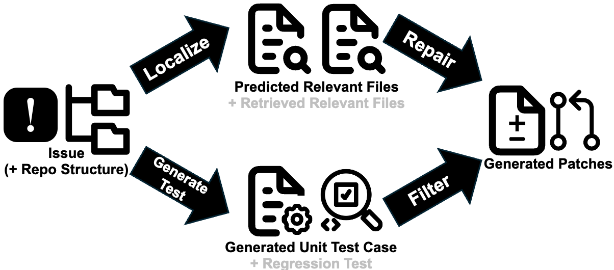

<div align="center"><h1>&nbsp;SWE-Swiss: A Multi-Task Fine-Tuning and RL Recipe for High-Performance Issue Resolution</h1></div>


<div align="center">

[](https://www.notion.so/SWE-Swiss-A-Multi-Task-Fine-Tuning-and-RL-Recipe-for-High-Performance-Issue-Resolution-21e174dedd4880ea829ed4c861c44f88#245174dedd488067a9e7eea04315dad5)
[](https://huggingface.co/SWE-Swiss/models)
[](https://huggingface.co/SWE-Swiss/datasets)
[]()

</div>


<p align="center">
  
</p>
<p align="center">
  <em><b>Figure 1:</b> Performance comparison on SWE-bench Verified. Our <b>32B</b> model, SWE-Swiss, achieves a top-tier score of <b>60.2%</b> among open-source models.</em>
</p>

## 📖 About The Project

**SWE-Swiss** presents a comprehensive recipe for creating high-performance model that can resolve real-world software issues. Our work introduces a methodology that significantly boosts the efficiency of language models, enabling our **32B** parameter model (`SWE-Swiss-32B`) to achieve a **60.2%** success rate on the SWE-bench Verified benchmark, a performance comparable to models more than double its size.

This repository contains the official code, data, and instructions to reproduce the results from our work, "SWE-Swiss: A Multi-Task Fine-Tuning and RL Recipe for High-Performance Issue Resolution".

---

## 💡 The SWE-Swiss Recipe

Our methodology is founded on deconstructing the complex task of issue resolution into three core, trainable skills and then applying a multi-phase training and evaluation strategy.

<p align="center">
  
</p>
<p align="center">
  <em><b>Figure 2:</b> The core workflow, enabled by three abilities: Localization, Repair, and Unit Test Generation.</em>
</p>

### Key Features
- **🧪 Three-Skill Curriculum:** We explicitly train for **Localization**, **Repair**, and **Unit Test Generation**.
- **🧠 Two-Phase Training:** A **Multi-Task SFT** phase for building a broad foundation, followed by a two-stage **Reinforcement Learning** curriculum the repair task.
- **🗳️ Enhanced Self-Consistency:** A novel evaluation method that uses similarity score to improve candidate selection, crucial for achieving top performance.
- **Open Source:** We provide our model weights, all curated training data, and guidlines to reproduce the results.

---

## 🎁 Open-Sourced Assets

We release the following assets to the community:
- **Weights for `SWE-Swiss-32B` and `SWE-Swiss-32B-SFT`:** Available on the [Hugging Face Hub](https://huggingface.co/SWE-Swiss/models).
- **All Curated Datasets:** The SFT and RL datasets are available on the [Hugging Face Hub](https://huggingface.co/SWE-Swiss/datasets).

## TODO
- [ ] Guidelines of SFT
- [ ] Guidelines of the evaluation pipeline
- [ ] Evaluation results
- [x] SFT model weights and RL model weghts
- [x] SFT data and RL data

All of the TODOs will be finished within this week.

## Citation
```bibtex
@misc{SWESwiss2025,
    title = {SWE-Swiss: A Multi-Task Fine-Tuning and RL Recipe for High-Performance Issue Resolution},
    url = {https://www.notion.so/SWE-Swiss-A-Multi-Task-Fine-Tuning-and-RL-Recipe-for-High-Performance-Issue-Resolution-21e174dedd4880ea829ed4c861c44f88},
    author = {He, Zhenyu and Yang, Qingping and Sheng, Wei and Zhong, Xiaojian and Zhang, Kechi and An, Chenxin and Shi, Wenlei and Cai, Tianle and He, Di and Chen, Jiaze and Xu, Jingjing and Wang, Mingxuan}
    year = {2025}
}
```

## 🙏 Acknowledgements
The training code base is heavily built on [Verl](https://github.com/volcengine/verl). The evaluation pipeline is adapted from [Agentless](https://github.com/OpenAutoCoder/Agentless) and [SWE-RL](https://github.com/facebookresearch/swe-rl/tree/main). The original data is from [SWE-bench](https://github.com/SWE-bench/SWE-bench), [SWE-Gym](https://github.com/SWE-Gym/SWE-Gym) and [SWE-smith](https://github.com/SWE-bench/SWE-smith). Our model is trained on top of [Qwen2.5-32B-Instruct](https://huggingface.co/Qwen/Qwen2.5-32B-Instruct). Thanks for their wonderful work.